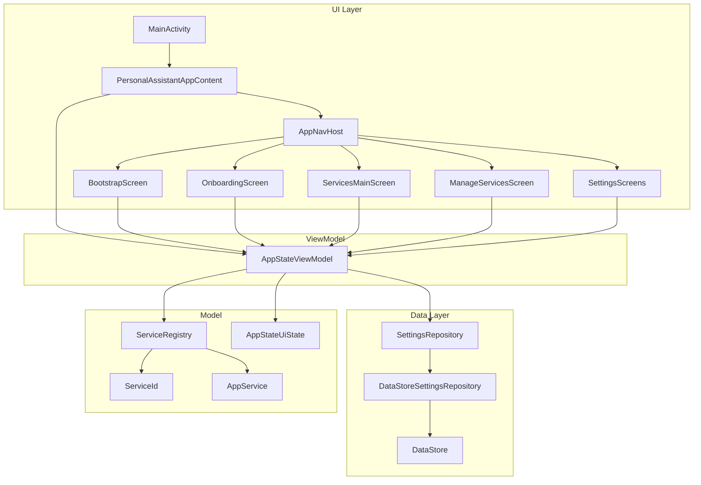

# Тотальный анализ Android-проекта Personal Assistant

---

## ЧАСТЬ 1: МЕТА-ИНФОРМАЦИЯ ПРОЕКТА

### 1.1 Базовая информация

| Параметр                         | Значение                                                                             |
| -------------------------------- | ------------------------------------------------------------------------------------ |
| **Название приложения**          | «Личный ассистент» ([strings.xml](app/src/main/res/values/strings.xml) — `app_name`) |
| **Package name (applicationId)** | `ru.topskiy.personalassistant`                                                       |
| **versionCode**                  | 1                                                                                    |
| **versionName**                  | "1.0"                                                                                |
| **minSdkVersion**                | 24                                                                                   |
| **targetSdkVersion**             | 36                                                                                   |
| **compileSdkVersion**            | 36                                                                                   |
| **Build tools**                  | Не указана явно (из AGP)                                                             |
| **Языки**                        | Kotlin 2.0.21, Java 11 (sourceCompatibility/targetCompatibility)                     |
| **NDK**                          | Не используется явно (Crashlytics NDK — через зависимость)                           |

### 1.2 Система сборки

- **Gradle**: 9.1.0 ([gradle-wrapper.properties](gradle/wrapper/gradle-wrapper.properties) — distributionUrl).
- **Android Gradle Plugin**: 9.0.0 (из [libs.versions.toml](gradle/libs.versions.toml)).
- **Файлы сборки**:
  - [build.gradle.kts](build.gradle.kts) — корень (плагины apply false).
  - [app/build.gradle.kts](app/build.gradle.kts) — модуль app (все зависимости и настройки).
  - [settings.gradle.kts](settings.gradle.kts) — имя проекта "Personal Assistant", include(":app").
- **gradle.properties**: `org.gradle.jvmargs=-Xmx2048m`, `android.useAndroidX=true`, `kotlin.code.style=official`, `android.nonTransitiveRClass=true`, `android.disallowKotlinSourceSets=false`.
- **Build types**: debug (по умолчанию), release (minify + shrinkResources + ProGuard).
- **Build flavors**: нет.
- **Version catalog**: [gradle/libs.versions.toml](gradle/libs.versions.toml) — версии agp, kotlin, compose BOM, hilt, firebase BOM, detekt, ksp, junit, androidx.*, lottie.

### 1.3 Структура проекта

- **Модули**: один — `:app`.
- **Зависимости между модулями**: нет (одномодульный проект).
- **Паттерн пакетов**: `ru.topskiy.personalassistant` + подпакеты `core.datastore`, `core.di`, `core.model`, `core.ui`, `ui.theme`.
- **Количество файлов** (по данным исследования):
  - **.kt**: 35 (32 main + 3 test/instrumented).
  - **.java**: 0.
  - **.xml**: 10 в app (AndroidManifest, res: drawable, mipmap, raw, values, xml).
  - **.gradle.kts**: 3 (root, settings, app).
- **Размер**: не измерялся; проект небольшой (один app-модуль, ~35 Kotlin-файлов).

---

## ЧАСТЬ 2: АРХИТЕКТУРА И ПАТТЕРНЫ

### 2.1 Архитектурный подход

- **Паттерн**: упрощённый **MVVM** с Jetpack Compose: один общий ViewModel ([AppStateViewModel](app/src/main/java/ru/topskiy/personalassistant/core/ui/AppStateViewModel.kt)) для состояния приложения и настроек.
- **Слои**: явного разделения на presentation/domain/data нет; фактически:
  - **Data**: `core.datastore` (SettingsRepository, DataStoreSettingsRepository), `core.model` (ServiceId, AppService, ServiceCategory, ServiceRegistry).
  - **Presentation**: `core.ui` (экраны, ViewModel, навигация).
- **Use cases**: нет отдельного слоя; логика «домашнего сервиса» и начальной навигации — в ViewModel и расширении `AppStateUiState.homeServiceId()`.
- **Repository**: один репозиторий — [SettingsRepository](app/src/main/java/ru/topskiy/personalassistant/core/datastore/SettingsRepository.kt) (интерфейс + DataStoreSettingsRepository); источник истины — DataStore Preferences.
- **Source of Truth**: DataStore для настроек; реестр сервисов — [ServiceRegistry](app/src/main/java/ru/topskiy/personalassistant/core/model/ServiceRegistry.kt) (object, статический).
- **Unidirectional Data Flow**: частично: UI читает StateFlow/SharedFlow из ViewModel; события (клики) вызывают методы ViewModel, которые пишут в репозиторий и при ошибках эмитят в SharedFlow (сообщения).

### 2.2 Управление состоянием

- **Компоненты**: `StateFlow` (uiState, themeMode, loadedCatalogViewMode), `SharedFlow` (messageEvent для Snackbar), `Flow` из репозитория (combine + stateIn).
- **UI-события**: `MutableSharedFlow<Int>` для одноразовых сообщений (string resource id); потребление в `LaunchedEffect` в Compose.
- **Поворот экрана**: состояние во ViewModel (stateIn с viewModelScope) сохраняется; Compose пересобирается по новым данным.
- **ViewModel lifecycle**: HiltViewModel, viewModelScope; SharingStarted.WhileSubscribed(5_000).
- **Сохранение при убийстве процесса**: критичное начальное состояние загружается в Bootstrap через getInitialSettings() из DataStore; UI-состояние главного экрана (currentServiceId) — в памяти, при пересоздании используется lastService из DataStore.

### 2.3 Внедрение зависимостей

- **Фреймворк**: **Hilt** (Dagger).
- **Модули**: [AppModule](app/src/main/java/ru/topskiy/personalassistant/core/di/AppModule.kt) — @Module @InstallIn(SingletonComponent::class), предоставляет SettingsRepository; [SettingsRepositoryEntryPoint](app/src/main/java/ru/topskiy/personalassistant/core/di/AppModule.kt) — EntryPoint для доступа к репозиторию из Application (до инициализации графа активности).
- **Scope**: SingletonComponent для репозитория; ViewModel — стандартный HiltViewModel.
- **Квалификаторы**: только @ApplicationContext для Context.
- **Provider/Factory**: стандартные Hilt (автогенерация).

### 2.4 Навигация

- **Компонент**: **Navigation Compose** (NavHost, composable).
- **Граф**: один [Navigation.kt](app/src/main/java/ru/topskiy/personalassistant/core/ui/Navigation.kt) — AppNavHost с маршрутами: bootstrap, onboarding, main, manage_services, settings, settings/appearance, settings/notifications, settings/about, settings/privacy.
- **Deep links**: не настроены.
- **Переходы**: программный navigate + popUpTo; анимации — slide + fade (enter/exit/popEnter/popExit), отдельные для «drawer-like» экранов (manage_services, settings).
- **Аргументы**: Safe Args не используются; аргументы не передаются (состояние через общий ViewModel и DataStore).

### 2.5 Паттерны проектирования

- **GoF и др.**: Singleton (ServiceRegistry, Hilt SingletonComponent), Repository, Observer (Flow/StateFlow), Factory (Hilt), Strategy (разные переходы по маршрутам).
- **Кастомные**: единый реестр сервисов (ServiceRegistry) как единственное место порядка и метаданных; ScreenParams для передачи контекста экранов.
- **Антипаттерны**: EntryPoint в Application для раннего доступа к репозиторию — обход нормального DI для bootstrap (осознанное решение); мутабельное поле hasMainScreenBeenShownThisProcess во ViewModel (сессионное состояние).

---

## ЧАСТЬ 3: UI И ИНТЕРФЕЙС

### 3.1 UI-технологии

- **Подход**: **100% Jetpack Compose**; XML только манифест и ресурсы (drawable, values, xml).
- **Compose BOM**: 2024.09.00.
- **Библиотеки**: Material 3, Material Icons Extended, Navigation Compose, Lottie (lottie-compose 6.6.0).

### 3.2 XML (ресурсы)

- **Layouts**: нет (все экраны — Composable).
- **Стили/темы**: [themes.xml](app/src/main/res/values/themes.xml) — Theme.PersonalAssistant (parent Material Light NoActionBar); используется для Activity.
- **Drawable**: ic_launcher_foreground/background, mipmap-anydpi-v26 (ic_launcher, ic_launcher_round).
- **Raw**: [day_night.json](app/src/main/res/raw/day_night.json) — Lottie-анимация переключения темы.
- **Menu**: нет отдельного menu XML.

### 3.3 Jetpack Compose

- **Composable**: экраны BootstrapScreen, OnboardingScreen, ServicesMainScreen, ManageServicesScreen, SettingsScreen, SettingsAppearanceScreen, SettingsNotificationsScreen, SettingsAboutScreen, SettingsPrivacyScreen; компоненты DrawerContent, DockBar, ServiceCatalogListView/Grid/Card, SettingsGroup/Row/SwitchRow; тема PersonalAssistantTheme, Color/Type в theme.
- **State hoisting**: локальный state (selectedServices, showServicesDialog и т.д.) в онбординге; themeMode, uiState — из ViewModel.
- **Recomposition**: использование stateIn, collectAsStateWithLifecycle; ключи в LazyRow/LazyColumn (key = { it.id }).
- **Модификаторы**: кастомный Modifier.drawerOpenGestureOnContent (свайп для открытия drawer) в [TopBarDrawerGesture.kt](app/src/main/java/ru/topskiy/personalassistant/core/ui/TopBarDrawerGesture.kt).

### 3.4 Адаптация

- **Экраны**: единый набор композабл; адаптивных layout-sw/dimens нет; BoxWithConstraints в ManageServicesScreen для расчёта columnCount сетки (по maxWidth и CATALOG_MIN_CARD_WIDTH_DP).
- **Планшеты/склады**: не заложены отдельно.
- **Ориентация**: без блокировки; контент переиспользуется.
- **Multi-window**: не настраивалось.
- **Вырезы**: enableEdgeToEdge в MainActivity; явной адаптации под notch не видно.

### 3.5 Компоненты

- **Activity**: [MainActivity](app/src/main/java/ru/topskiy/personalassistant/MainActivity.kt) — одна, ComponentActivity, setContent { PersonalAssistantAppContent() }; exported=true, LAUNCHER.
- **Fragment**: нет.
- **Service**: нет.
- **BroadcastReceiver**: нет.
- **ContentProvider**: нет.
- **Кастомные View**: нет (всё Compose).
- **Адаптеры**: нет RecyclerView; LazyRow/LazyColumn с items/lazy items.

### 3.6 Ресурсы

- **Строки**: [strings.xml](app/src/main/res/values/strings.xml) — app_name, общие, drawer, onboarding, избранный сервис, управление сервисами, настройки, сервисы, категории, главный экран (всё на русском).
- **Цвета**: [colors.xml](app/src/main/res/values/colors.xml) — стандартные purple/teal; основные цвета приложения в [Color.kt](app/src/main/java/ru/topskiy/personalassistant/ui/theme/Color.kt) (Drawer, TopAppBar, Screen, Catalog, Dock, Onboarding, Switch, Favorite).
- **Размеры/массивы**: отдельного dimens/arrays не используется; константы в коде (dp).
- **Шрифты**: [Type.kt](app/src/main/java/ru/topskiy/personalassistant/ui/theme/Type.kt) — Typography на базе FontFamily.SansSerif (системный/Roboto).
- **Изображения**: только иконки лаунчера (vector + mipmap).

---

## ЧАСТЬ 4: ДАННЫЕ И ХРАНЕНИЕ

### 4.1 Локальные БД

- **Room/SQLite/Realm**: не используются.

### 4.2 Локальное хранилище

- **DataStore**: Preferences; файл `settings` ([SettingsRepository.kt](app/src/main/java/ru/topskiy/personalassistant/core/datastore/SettingsRepository.kt)); extension `Context.settingsDataStore`.
- **Ключи**: enabled_services (stringSet), favorite_service (string), last_service (string), onboarding_done (boolean), theme (string "light"|"dark"), services_catalog_list_view (boolean).
- **SharedPreferences**: не используются напрямую.
- **EncryptedSharedPreferences / Keystore**: не используются.

### 4.3 Сетевое взаимодействие

- **HTTP-клиент**: нет (Retrofit/OkHttp не подключены); только Firebase SDK (Analytics, Crashlytics) — их сетевые вызовы.
- **API/endpoints**: не определены в коде приложения.

### 4.4 Модели данных

- **Data-классы**: [AppService](app/src/main/java/ru/topskiy/personalassistant/core/model/AppService.kt), [InitialSettings](app/src/main/java/ru/topskiy/personalassistant/core/datastore/SettingsRepository.kt), [AppStateUiState](app/src/main/java/ru/topskiy/personalassistant/core/ui/AppStateViewModel.kt), [ScreenParams](app/src/main/java/ru/topskiy/personalassistant/core/ui/ScreenParams.kt).
- **Мапперы**: нет (данные DataStore маппятся в репозитории в Set/String).
- **Parcelable/Serializable**: не требуются (навигация без аргументов).
- **Sealed classes**: нет для состояний экранов.

### 4.5 Синхронизация

- **Оффлайн**: приложение полностью оффлайн (кроме Firebase).
- **WorkManager**: не используется.

---

## ЧАСТЬ 5: АСИНХРОННОСТЬ И МНОГОПОТОЧНОСТЬ

### 5.1 Корутины

- **Scope**: viewModelScope в AppStateViewModel; rememberCoroutineScope в Compose; ProcessLifecycleOwner.get().lifecycleScope в Application.
- **Dispatchers**: Main.immediate в Application для launch; withContext(Dispatchers.IO) для ensureThemeInitialized; в репозитории edit/read — вызывающий поток (обычно Main), DataStore сам использует IO внутри.
- **Flow**: cold (dataStore.data.map); stateIn(WhileSubscribed(5_000)); combine для uiState.
- **Channel**: не используется; одноразовые события — SharedFlow.
- **Исключения**: runCatching в репозитории; onFailure — emit messageEvent; в DataStore .catch { emit(emptyPreferences()) }.
- **SupervisorJob**: не задаётся явно (стандартный viewModelScope).

### 5.2 RxJava

- Не используется.

### 5.3 Фоновые задачи

- **WorkManager**: нет.
- **Foreground/Background Services**: нет.
- **JobScheduler/AlarmManager**: нет.
- Инициализация темы — разово в Application через lifecycleScope.

---

## ЧАСТЬ 6: ОСОБЕННОСТИ ANDROID

### 6.1 Разрешения

- В [AndroidManifest.xml](app/src/main/AndroidManifest.xml) явных  нет (только дефолты от системы/библиотек при необходимости).
- Опасные разрешения и runtime-запросы не используются.

### 6.2 Пуш-уведомления

- FCM не подключался; уведомления в настройках — заглушка (переключатель без персистентного сохранения и без каналов).

### 6.3 Фоновые процессы

- Нет длительных фоновых задач; Doze/battery не настраивались специально.

### 6.4 Интеграции

- **Firebase**: Analytics (screen_view по маршрутам в [Navigation.kt](app/src/main/java/ru/topskiy/personalassistant/core/ui/Navigation.kt)), Crashlytics + Crashlytics NDK; [google-services.json](app/google-services.json) в проекте (заглушка/реальный — по окружению).
- **Google Services**: только Firebase (Maps, Auth, платежи — нет).
- **Analytics**: Firebase Analytics; события — SCREEN_VIEW с screen_name.
- **Crash reporting**: Firebase Crashlytics; mappingFileUploadEnabled, nativeSymbolUploadEnabled в build.gradle.kts.

### 6.5 App Widgets

- Нет.

---

## ЧАСТЬ 7: ПРОИЗВОДИТЕЛЬНОСТЬ

### 7.1 Память

- Утечки: ViewModel и репозиторий через Hilt; подписки через viewModelScope — отмена при очистке ViewModel. Явных утечек не видно.
- Bitmap: только векторные иконки и Lottie; тяжёлой работы с изображениями нет.
- largeHeap: не запрашивается.

### 7.2 UI

- RecyclerView: нет; LazyRow/LazyColumn с key; DiffUtil не используется (списки небольшие).
- Загрузка изображений: нет (Coil/Glide не используются).
- ViewStub: нет (Compose).
- ConstraintLayout: нет (Compose).

### 7.3 Запуск

- [PersonalAssistantApp](app/src/main/java/ru/topskiy/personalassistant/PersonalAssistantApp.kt): Firebase init, Crashlytics enable, lifecycleScope — ensureThemeInitialized через EntryPoint (SettingsRepository).
- ContentProviders для автозапуска: нет.
- Splash: BootstrapScreen с текстом «Загрузка…» и навигацией после getInitialState().
- App Startup: не используется.

### 7.4 Батарея

- WakeLocks: не используются.
- Сетевые запросы: только Firebase (пакетный/оптимизированный со стороны SDK).

---

## ЧАСТЬ 8: БЕЗОПАСНОСТЬ

### 8.1 Хранение данных

- Данные настроек в DataStore не шифруются (EncryptedSharedPreferences/Keystore не используются).
- Root detection: нет.

### 8.2 Сетевая безопасность

- Явного Network Security Config нет; используется стандартное поведение (HTTPS для Firebase).
- SSL Pinning: нет.
- ProGuard: включён в release; правила в [proguard-rules.pro](app/proguard-rules.pro) для Hilt, DataStore, моделей (ServiceId, SettingsRepository и т.д.), Firebase Crashlytics/Analytics.
- В логах: Log.e в репозитории (TAG, исключения); чувствительные данные не логируются.

### 8.3 Компоненты

- **Exported**: MainActivity exported=true (лаунчер — необходимо).
- **Intent filters**: только MAIN/LAUNCHER.
- **Custom permissions**: нет.
- **Deep links**: нет; валидация не применима.

### 8.4 Код

- Obfuscation: включён в release (minifyEnabled); keep-правила для Hilt, DataStore, моделей, Crashlytics.
- Секреты: google-services.json в репозитории (README предупреждает о замене на реальный для Firebase); хардкод API-ключей в коде не обнаружен.
- BuildConfig: buildFeatures.buildConfig = true (для возможного использования без явных секретов в коде).

---

## ЧАСТЬ 9: ТЕСТИРОВАНИЕ

### 9.1 Unit-тесты

- **Фреймворки**: JUnit 4, kotlin.test (assertEquals, assertTrue и т.д.); kotlinx.coroutines test (runTest, ExperimentalCoroutinesApi).
- **Классы**: [ServiceRegistryTest](app/src/test/java/ru/topskiy/personalassistant/ServiceRegistryTest.kt), [SettingsRepositoryTest](app/src/test/java/ru/topskiy/personalassistant/core/datastore/SettingsRepositoryTest.kt), [AppStateViewModelTest](app/src/test/java/ru/topskiy/personalassistant/core/ui/AppStateViewModelTest.kt).
- **Покрытие**: не измерялось; покрыты ServiceRegistry, репозиторий (DataStore через in-memory/temp file), ViewModel (FakeSettingsRepository).
- **Fixtures**: FakeSettingsRepository в AppStateViewModelTest; в SettingsRepositoryTest — создание DataStore в build/tmp.

### 9.2 Android/UI-тесты

- **Instrumented**: [AppContextAndSettingsInstrumentedTest](app/src/androidTest/java/ru/topskiy/personalassistant/AppContextAndSettingsInstrumentedTest.kt) (package, EntryPoint, getInitialSettings), [BootstrapFlowTest](app/src/androidTest/java/ru/topskiy/personalassistant/BootstrapFlowTest.kt) (отображение «Загрузка…»), [OnboardingMainManageSettingsUiTest](app/src/androidTest/java/ru/topskiy/personalassistant/OnboardingMainManageSettingsUiTest.kt) (онбординг, главный экран, drawer, управление сервисами, запрет выключить последний сервис, настройки и тема).
- **Compose**: createAndroidComposeRule, onNodeWithText/onNodeWithTag/onNodeWithContentDescription, performClick, waitUntil.
- **Замечание**: В `settings_screenOpensAndThemeCanBeSwitched` проверяются строки settings_theme_section, theme_light, theme_dark на экране сразу после открытия «Настройки». Эти строки отображаются на подэкране «Внешний вид», а не на главном экране настроек — возможный баг теста (нужен переход в «Внешний вид»).

### 9.3 Интеграционные

- Тесты репозитория с реальным DataStore (файл) — ближе к интеграционным; отдельного mock-сервера/API нет.

---

## ЧАСТЬ 10: ЗАВИСИМОСТИ

### 10.1 Библиотеки (из [app/build.gradle.kts](app/build.gradle.kts) и [libs.versions.toml](gradle/libs.versions.toml))

- **Platform**: firebase-bom 33.7.0, compose-bom 2024.09.00.
- **Implementation**: firebase-analytics, firebase-crashlytics, firebase-crashlytics-ndk, hilt-android 2.59.1, core-ktx 1.17.0, lifecycle-runtime-ktx 2.10.0, lifecycle-process, activity-compose 1.12.2, compose-ui, compose-ui-graphics, compose-ui-tooling-preview, material3, material-icons-extended, navigation-compose 2.8.4, datastore-preferences 1.1.1, lifecycle-viewmodel-compose, lifecycle-runtime-compose, lottie-compose 6.6.0.
- **KSP**: hilt-compiler.
- **Test**: junit 4.13.2; androidTest: androidx.junit 1.3.0, espresso-core 3.7.0, compose-ui-test-junit4; debug: compose-ui-tooling, compose-ui-test-manifest.
- **Detekt**: detekt-formatting.
- Транзитивные конфликты и устаревшие версии в отчёте не анализировались (требуется отдельный прогон dependencyInsight).

### 10.2 Лицензии

- Не проверялись; типичный набор (Apache 2.0, и т.д.) — на усмотрение команды.

---

## ЧАСТЬ 11: КАЧЕСТВО КОДА

### 11.1 Статистика

- Классы/интерфейсы: порядка 25+ (ViewModel, Repository, модели, экраны, компоненты).
- Методы: не подсчитывались автоматически.
- **TODO/FIXME**: один TODO в [data_extraction_rules.xml](app/src/main/res/xml/data_extraction_rules.xml) (настройка backup include/exclude).

### 11.2 Стиль

- **Detekt**: включён ([detekt.yml](detekt.yml)) — MagicNumber (с исключениями), MaxLineLength 120, WildcardImport, MagicString, ReturnCount, UnusedPrivateMember, UnusedImports; buildUponDefaultConfig, allRules = false.
- **Code style**: kotlin.code.style=official в gradle.properties.
- Именование: Kotlin-стиль, осмысленные имена экранов и репозитория.

### 11.3 Качество

- **Code smells**: мутабельное hasMainScreenBeenShownThisProcess; возможная избыточность дублирования цветов/строк между экранами (приемлемо для размера проекта).
- **Dead code**: строка theme_system в strings.xml не используется (в UI только light/dark).
- **Магические числа**: частично вынесены в константы (DOCK_ITEM_WIDTH_DP, PRESS_AGAIN_TO_EXIT_INTERVAL_MS и т.д.); в detekt исключения для MagicNumber в тестах и Color.kt.
- **Null safety**: Kotlin null-safety; Result для suspend-операций репозитория.

---

## ЧАСТЬ 12: ДОКУМЕНТАЦИЯ

### 12.1 README

- [README.md](README.md): название, краткий архитектурный обзор (таблица слоёв), ServiceRegistry и навигация, хранение настроек, технологический стек, требования (minSdk/targetSdk), сборка в Android Studio и из командной строки, раздел про Firebase (google-services.json).

### 12.2 Код

- KDoc: на ключевых классах (ServiceRegistry, AppService, ServiceCategory, SettingsRepository, AppStateViewModel, BootstrapScreen и др.); не на каждом методе.
- ADR: нет.

### 12.3 API

- Собственного backend API нет; документация не применима.

---

## ЧАСТЬ 13: CI/CD И ДЕПЛОЙ

### 13.1 CI/CD

- **GitHub Actions / GitLab CI / Jenkins**: конфигураций в репозитории не найдено (папка .github отсутствует).

### 13.2 Дистрибуция

- Google Play / треки / Firebase App Distribution в коде не заданы; подписание — стандартное (debug/release через build.gradle).

---

## ЧАСТЬ 14: АНАЛИТИКА И МОНИТОРИНГ

### 14.1 Аналитика

- **События**: Firebase Analytics SCREEN_VIEW с параметром screen_name (onboarding, main, settings, manage_services, settings_appearance, settings_notifications, settings_about, settings_privacy).
- **User properties**: не настраивались в коде.
- **Screen tracking**: в LaunchedEffect при смене currentBackStackEntry в AppNavHost.

### 14.2 Краши и логи

- **Crashlytics**: включён в Application; NDK и mapping upload в release.
- **Обработка ошибок**: Result в репозитории; сообщения пользователю через SharedFlow (string res id) и Snackbar.
- **Логирование**: Log.e в DataStoreSettingsRepository при ошибках; тег "DataStoreSettingsRepository" и "AppStateViewModel".

---

## ЧАСТЬ 15: ФИНАЛЬНЫЙ АНАЛИЗ

### 15.1 Сильные стороны

- Чёткая структура пакетов (core/datastore, di, model, ui; theme).
- Один источник истины для сервисов (ServiceRegistry) и для настроек (DataStore + SettingsRepository).
- Hilt + интерфейс репозитория — удобно для тестов (Fake).
- Современный стек: Kotlin, Compose, Material 3, Navigation Compose, DataStore, корутины/Flow.
- ProGuard и правила для Hilt/DataStore/Firebase заданы.
- Unit- и UI-тесты покрывают критичные сценарии и репозиторий/ViewModel.
- README с архитектурой и сборкой.

### 15.2 Слабые стороны

- Нет разделения на domain/data слои и use cases; один «толстый» ViewModel.
- DataStore не шифруется; для чувствительных настроек лучше EncryptedSharedPreferences/DataStore.
- Нет CI (сборка/тесты не автоматизированы в репозитории).
- Строка theme_system не используется; уведомления — заглушка (состояние не сохраняется в DataStore).
- Возможный баг UI-теста (проверка строк темы на главном экране настроек вместо «Внешний вид»).
- Backup/data extraction rules не настроены (TODO в XML).

### 15.3 Рекомендации

- Добавить переход в «Внешний вид» в тесте настроек или скорректировать ожидаемые строки.
- Сохранять настройку уведомлений в DataStore и при необходимости добавить каналы уведомлений.
- Рассмотреть EncryptedDataStore/EncryptedSharedPreferences при появлении чувствительных данных.
- Добавить CI (хотя бы Gradle: assemble, unit + instrumented тесты).
- Настроить backup/data_extraction_rules (include/exclude) под политику бэкапа.
- Удалить или использовать theme_system; при желании — поддержать системную тему (следование system uiMode).

### 15.4 Оценка проекта (1–10)

| Критерий                    | Оценка | Комментарий                                                                                                                           |
| --------------------------- | ------ | ------------------------------------------------------------------------------------------------------------------------------------- |
| **Архитектура**             | 7/10   | Понятный MVVM и репозиторий; нет domain-слоя и use cases.                                                                             |
| **Качество кода**           | 8/10   | Чистый Kotlin, Detekt, тесты; мелкие недочёты (неиспользуемая строка, TODO).                                                          |
| **Производительность**      | 8/10   | Нет тяжёлых операций; LazyRow/LazyColumn с key.                                                                                       |
| **Безопасность**            | 6/10   | Нет шифрования настроек; ProGuard и правила есть.                                                                                     |
| **Тестирование**            | 7/10   | Хорошее покрытие репозитория и ViewModel; один UI-тест с сомнительными ожиданиями.                                                    |
| **Документация**            | 7/10   | README и KDoc на основных сущностях; нет ADR и API-документации (не применимо).                                                       |
| **Готовность к продакшену** | 7/10   | Для внутреннего/кастомного использования достаточно; для публичного стора — доработать backup, уведомления, возможно шифрование и CI. |

---

## Диаграмма высокоуровневой архитектуры

---

Отчёт подготовлен по текущему состоянию репозитория без выполнения изменений в коде (режим планирования).